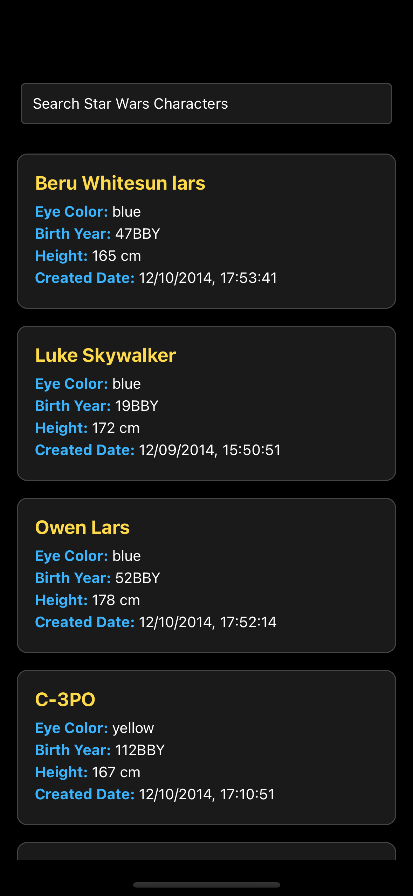

# StarWarsExpo

This is a **React Native Expo** project that allows users to explore Star Wars characters by fetching data from the [Star Wars API (SWAPI)](https://swapi.dev/).

## Features
- Search for Star Wars characters by name.
- Display character details like name, eye color, birth year, height, and more.
- Infinite scrolling with pagination to load more characters as you scroll.

## Installation and Running the Project

### Prerequisites
To run this project, ensure that you have the following installed:

- **Node.js** (v12.x or later) [Download from Node.js](https://nodejs.org/)
- **npm** or **yarn** (comes with Node.js)
- **Expo CLI** (install globally)

To install Expo CLI, run:

```bash
npm install -g expo-cli
```

### Step 1: Clone the Repository

First, clone this repository to your local machine:

```bash
git clone https://github.com/barabasizsolt/StarWarsExpo.git
```

### Step 2: Navigate to the Project Directory

Once you have cloned the repository, navigate into the project directory:

```bash
cd StarWarsExpo
```

### Step 3: Install Dependencies

After navigating to the project folder, install the required dependencies using npm or yarn:

Using npm:

```bash
npm install
```

This will open the Expo Developer Tools in your browser.

### Step 5: Run on a Device or Emulator

You can now run the project on a physical device or an emulator:

- **Run on iOS**: 
```bash
npm run ios
```
- **Run on Android**: 
```bash
npm run android
```

### Step 6: Testing

Test are under __tests__/StarWarsCharacters-test.tsx:

- **Run the test**: 
```bash
npm run test
```

## Project Structure

- **src/data/**: Constains Data fetching logic + API respose models.
- **src/ui/**: Contains the main screens of the app + custom hook for the screen.
- **App.tsx**: Apps' entry point.

## Dependencies

- **React Native & TypeScript**: Framework for building mobile apps using React with TypeScript.
- **Expo**: A framework and platform for universal React applications.
- **SWAPI**: The Star Wars API used to fetch character data.
- **Jest**: Test library.

## Screenshot


